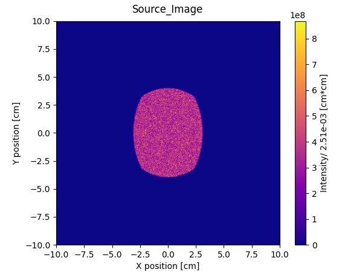
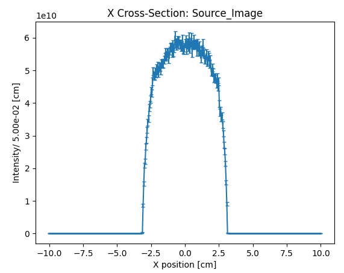
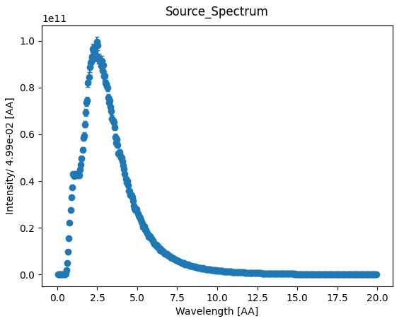
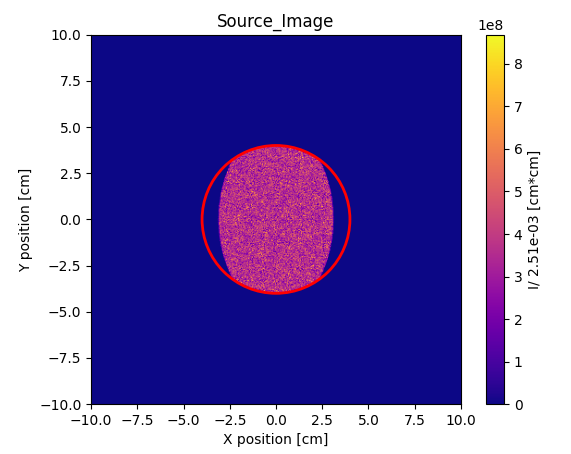
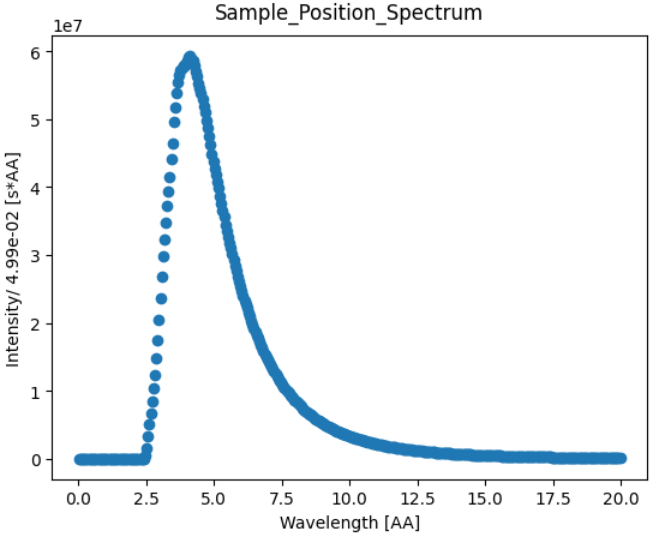
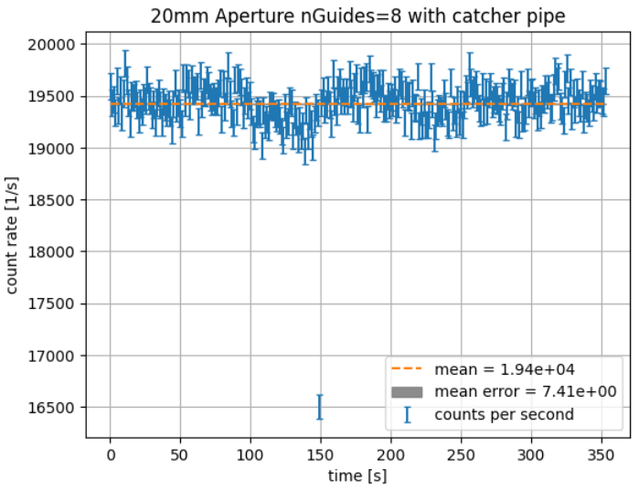
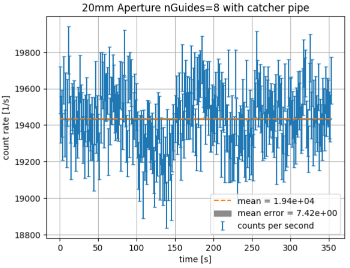
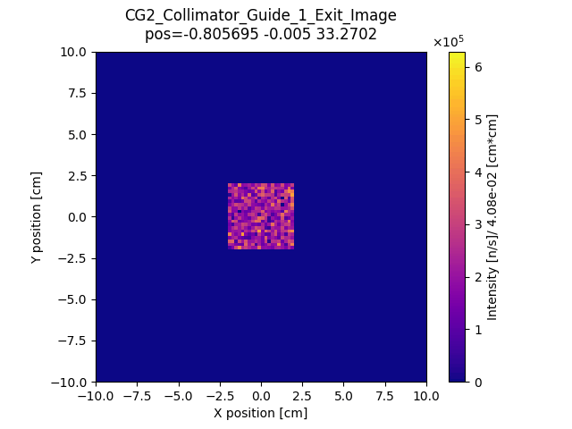
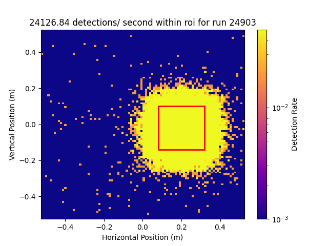

# McStas Reduction Analysis
A collection of python tools for plotting, analysis, and reduction of McStas output data and .nxs.h5 experimental output data.

## Description
Most tools are specifically for finding quick results from McStas output .dat data, but some such as beamFOM.py are for viewing and reducing .nxs.h5 data from real experiment monitors.

## Usage

### Display

Display an output file by specifying filename and type of display desired. For 1d input data, currently no other plot types are available. For 2d input data, options for plot type include 'full' (default) showing 2d plot of output, 'x' showing x-z cross section of input data, or 'y' for y-z cross section of input data. The flag '--showN' is passed to show both the Intensity plot and the N plot (statistics for each bin).

```
usage: display.py [-h] [--showN] inFile [{x,y,full}]

positional arguments:
  inFile      Input file
  {x,y,full}  Plot type: 'x', 'y', or 'full'

options:
  -h, --help  show this help message and exit
  --showN     if true then display plots for N
```

#### Example outputs:
`$ python3 display.py Source_image.dat`  

  

`$ python3 display.py Source_image.dat x`    

  

`$ python3 display.py Source_spectrum.dat`  



### Find counts within ROI

Find counts within a specified region of interest. Two types of ROIs are available, specified with --square or --circle. Square ROI coordinates define x and y bounds, while circle ROI coordinates and radius define center of circle and radius. Total counts within region are found from Intensity data, and error on counts found from Intensity error data. The flag '--noshow' is passed to specify that the plot showing region of interest and intensity distribution is undesired, and only the counting result should be shown.

```
usage: count.py [-h] [--square x0 x1 y0 y1] [--circle x0 y0 radius] [--noshow] filename

Process MCStas data and extract ROI.

positional arguments:
  filename              MCStas data filename

options:
  -h, --help            show this help message and exit
  --square x0 x1 y0 y1  Square ROI limits: x0 x1 y0 y1
  --circle x0 y0 radius
                        Circular ROI limits: x0 y0 radius
  --noshow              if true then dont display graph, only show count
```

#### Example outputs:
`$ python3 count.py Source_image.dat --circle 0 0 4`  

Sum within ROI:  6.11e+12  ±  4.91e+10  
Area within ROI:  5.03e+01 [cm*cm]

  

`$ python3 count.py Source_image.dat --square -3 3 -3 3`  

Sum within ROI:  5.04e+12  ±  4.46e+10  
Area within ROI:  3.60e+01 [cm*cm]  


### Describe 1d spectra output

Find FWHM, peak wavelength, intensity within FWHM, and error on intensity within FWHM. Option '--noshow' causes program to only print derived quantities without showing 1d graph.

```
usage: count_1d.py [-h] [--noshow] inFile

positional arguments:
  inFile      Input file

options:
  -h, --help  show this help message and exit
  --noshow    if true then dont display graph, only show count
```

#### Example outputs:
`python3 python3 count_1d.py Sample_Position_spectrum.dat`

fwhm: 2.60  
wavelength: 4.125, intensity: 59253294.15  
sum within fwhm: 2435743247.6000004 ± 4277768.25916  



### Verify experimental run

Confirm average beam intensity is constant throughout run. Plot and remove outliers if not. Using the '--rebin' flag, the data can be re-binned into larger bins for better results. The '--outlier' flag can be used to specify a threshold for removing outliers as 'n' sigma away from the mean. '--noshow' will only print average counts/second along with Poisson deviance and exit without showing plot of counts/second throughout entire run, which can be useful in identifying periods of time where measured intensity does not match mean.

```
usage: beamFOM.py [-h] [--rebin newSize] [--outlier n] [--noshow] inFile

positional arguments:
  inFile           Input file

optional arguments:
  -h, --help       show this help message and exit
  --rebin newSize  Resized array length: newSize
  --outlier n      if true, then eliminate datapoints greater than n sigma
                   away from the mean
  --noshow         if true then only show value, dont display plot
```

#### Example outputs:
`python3 beamFOM.py CG2_run_num.nxs.h5 --rebin 300`

! New size is not a factor of old size, cutting out last  254  entries  
! New size is not a factor of old size, cutting out last  254  entries  
! New size is not a factor of old size, cutting out last  254  entries  
1.94e+04 ± 7.41e+00  counts/ second  
deviance/ ndof =  2.7690690750484324  



`python3 beamFOM.py CG2_run_num.nxs.h5 --rebin 300 --outlier 7`

! New size is not a factor of old size, cutting out last  254  entries  
! New size is not a factor of old size, cutting out last  254  entries  
! New size is not a factor of old size, cutting out last  254  entries  
1.94e+04 ± 7.41e+00  counts/ second  
deviance/ ndof =  2.7690690750484324  
with outliers removed :  
1.94e+04 ± 7.42e+00  counts/ second  
deviance/ ndof =  1.2133389079191892  



## Display beam profile evolution or compare image between runs

Uses display.py to show a sequence of plots in video form. Can be used to compare beam profile throughout instrument if multiple detectors are placed along the beam at important segments. Can also be used to compare beam profile at a specific point across multiple runs if properly specified. '--save [output].gif' will save the video as a gif with the specified filename, and the video will not repeat. During the video you can also pause the animation with the spacebar, but it is always a frame late.

```
usage: display_sequence.py [-h] [--save outFile] filenames [filenames ...]

Plot data from files as a video

positional arguments:
  filenames       Input filenames (supports wildcard patterns)

options:
  -h, --help      show this help message and exit
  --save outFile  if provided, save video as GIF with specified output file name
```

### Example outputs:

#### Showing beam profile evolution throughout a single run
`$ python3 display_sequence.py CG2_collimator_guide_*_exit_image.dat --save`

sequence: 
['./CG2_collimator_guide_1_exit_image.dat', './CG2_collimator_guide_2_exit_image.dat', './CG2_collimator_guide_3_exit_image.dat', './CG2_collimator_guide_4_exit_image.dat', './CG2_collimator_guide_5_exit_image.dat', './CG2_collimator_guide_6_exit_image.dat', './CG2_collimator_guide_7_exit_image.dat', './CG2_collimator_guide_8_exit_image.dat'] 
  

#### Comparing beam profile evolution over multiple runs 
So far this use case has not been applied using this tool, but in previous work a similar result was produced: 
  

## Contributing and contact
Open to contributions, contact rogersjm@ornl.gov or jroger87@vols.utk.edu

## Authors and acknowledgment
Thanks to Dr. Frost for providing most of mcstasHelper.py functions for reading McStas output data.

## License
under GNU AFFERO GENERAL PUBLIC LICENSE

## Project status
Currently in progress, will be built upon at least until the end of July 2023
