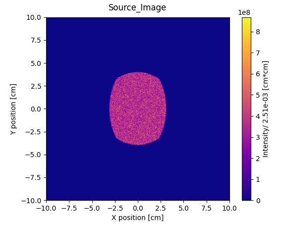
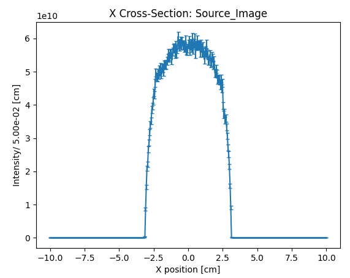
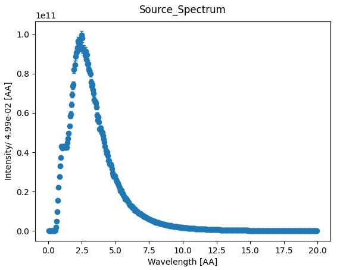
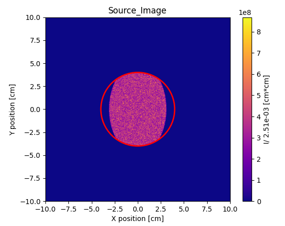

# McStas Reduction Analysis
A collection of python tools for plotting, analysis, and reduction of McStas output data

## Description
Currently only supports plotting and finding counts within specified ROI definitions. mcstasHelper.py includes some functions useful for reading McStas output data.

## Usage

### Display
Display an output file by specifying filename and type of display desired. For 1d input data, currently no other plot types are available. For 2d input data, options include 'full' (default) showing 2d plot of output, 'x' showing x-z cross section of input data, or 'y' for y-z cross section of input data.

```
usage: display.py [-h] inFile [{x,y,full}]

positional arguments:
  inFile      Input file
  {x,y,full}  Plot type: 'x', 'y', or 'full'

options:
  -h, --help  show this help message and exit

```

#### Example outputs:
`$ python3 display.py Source_image.dat`  

  

`$ python3 display.py Source_image.dat x`    

  

`$ python3 display.py Source_spectrum.dat`  



### Find counts within ROI
Find counts within a specified region of interest. Two types of ROIs are available, specified with --square or --circle. Square ROI coordinates define x and y bounds, while circle ROI coordinates and radius define center of circle and radius. Total counts within region are found from Intensity data, and error on counts found from Intensity error data. 

```
usage: count.py [-h] [--square x0 x1 y0 y1] [--circle x0 y0 radius] filename

Process MCStas data and extract ROI.

positional arguments:
  filename              MCStas data filename

options:
  -h, --help            show this help message and exit
  --square x0 x1 y0 y1  Square ROI limits: x0 x1 y0 y1
  --circle x0 y0 radius
                        Circular ROI limits: x0 y0 radius
```

#### Example outputs:
`$ python3 count.py Source_image.dat --circle 0 0 4`  

Sum within ROI:  6.11e+12  ±  4.91e+10  
Area within ROI:  5.03e+01 [cm*cm]

  

`$ python3 count.py Source_image.dat --square -3 3 -3 3`  

Sum within ROI:  5.04e+12  ±  4.46e+10  
Area within ROI:  3.60e+01 [cm*cm]  


## Contributing and contact
Open to contributions, contact rogersjm@ornl.gov or jroger87@vols.utk.edu

## Authors and acknowledgment
Thanks to Dr. Frost for providing most of mcstasHelper.py functions for reading McStas output data

## License
under GNU AFFERO GENERAL PUBLIC LICENSE

## Project status
Currently in progress, will be built upon at least until the end of July 2023
